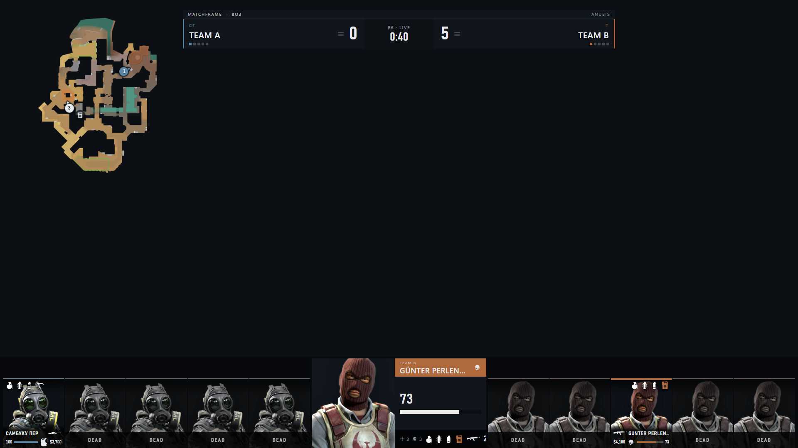
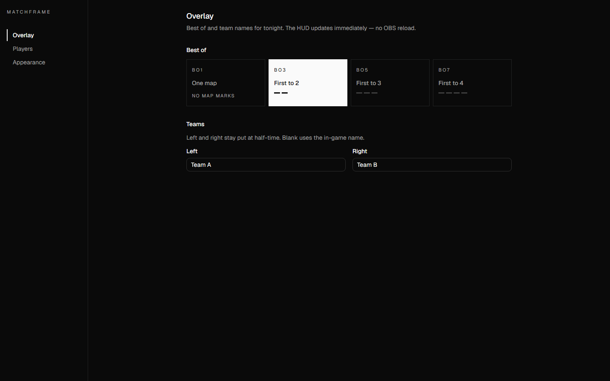
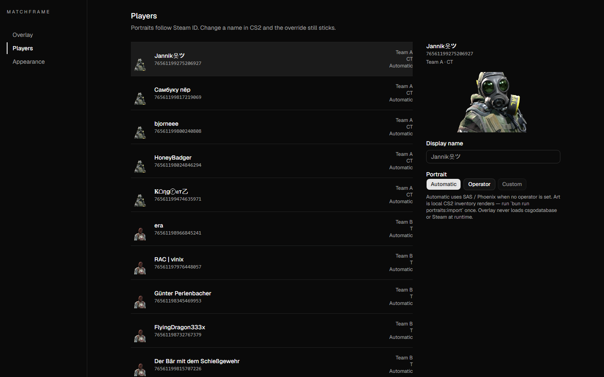
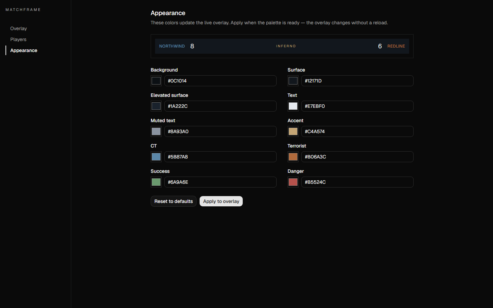

# Matchframe

Local-first CS2 broadcast overlays for OBS.



Matchframe takes Counter-Strike 2 Game State Integration, normalizes it, and
drives a 1920×1080 HUD over a local WebSocket. Set Best of, team names,
portraits, and colors in the dashboard — the overlay updates without reloading
OBS.

<p align="center"><sub>Fixture preview. Counter-Strike artwork in screenshots remains property of Valve Corporation. Matchframe is not affiliated with or endorsed by Valve.</sub></p>

## Overlay

Point an OBS Browser Source at http://localhost:5174. Keep it at 1920×1080 with
a transparent background.

The HUD shows score, round clock, player rows, loadouts, bomb timers, and a
tactical radar. Event, stage, and sponsor still ride on the overlay URL
(`event`, `stage`, `sponsor`). Add `preview=1` to preview the HUD on a dark
plate outside OBS.

## Dashboard

Open http://localhost:5173 when the stack is running.

**Overlay** — Best of and team names for tonight. Left and right stay put at
half-time.



**Players** — Display names and portraits, keyed by Steam ID. A name change in
CS2 does not drop the override.



**Appearance** — Colors apply to the live overlay. No OBS reload.



## Quick start

```bash
bun install
bun run dev
```

| App | URL |
| --- | --- |
| Dashboard | http://localhost:5173 |
| Overlay | http://localhost:5174 |
| Broadcast server | http://localhost:3131 |

Copy `apps/server/gsi/gamestate_integration_matchframe.cfg` into your CS2 `cfg`
folder (typically `game/csgo/cfg/`) and restart CS2.

Spectator / GOTV is required for `allplayers`. Round clocks need
`phase_countdowns` (already in the Matchframe cfg).

Optional operator portraits:

```bash
bun run portraits:import
```

That writes local inventory renders into `apps/server/data/portraits`
(gitignored). The overlay loads them from the broadcast server, never from
csgodatabase, Steam, or another CDN.

## CS2 Game State Integration

Radar needs these flags in the GSI cfg:

- `allplayers_position` `"1"` — world `position` and `forward` on every player
- `bomb` `"1"` — bomb state and world position when dropped or planted
- `grenades` `"1"` — world grenade entities (already in the Matchframe cfg)

Facing is the `forward` vector sent with `allplayers_position`. There is no
separate GSI orientation flag.

The overlay never fetches icons, portraits, or radar images from the network.
Swap the packs under `apps/overlay/src/assets` without touching GameState.

## Preview without CS2

```bash
bun run fixture:gsi
bun run fixture:gsi equipment
bun run fixture:gsi radar-anubis-bomb-planted
bun run fixture:gsi demo:defuse
```

`live` is the default. `bun run fixture:gsi` with an unknown name prints the
full variant list.

To dump a sanitized merged GSI payload while CS2 is running:

```bash
MATCHFRAME_GSI_CAPTURE=1 bun run dev
bun run capture:gsi
```

The capture file is `apps/server/data/gsi-capture/latest.json` (gitignored).

## Architecture

```
CS2 GSI  →  parser  →  GameState  →  WebSocket  →  overlay
                         ↑
                    dashboard
```

`packages/gsi` speaks Valve. `packages/game-state` does not. The overlay never
consumes raw GSI payloads.

## Development

The dashboard talks to `/api` on its own origin; Vite proxies that to the
broadcast server. Override with `VITE_API_URL` only if the dashboard must call
the server directly. Override the overlay socket with `VITE_REALTIME_URL`
(default `ws://localhost:3131/ws`).

After changing `packages/game-state`, `packages/gsi`, `packages/maps`,
`packages/theme`, or `packages/presentation`, stop and re-run `bun run dev`
from a fresh process, then refresh the overlay. Bun does not watch those
packages from `apps/server`.

```bash
bun test
bun run typecheck
bun run build
```

Dashboard components:

```bash
bunx shadcn@latest add button -c apps/dashboard
```

```tsx
import { Button } from "@workspace/ui/components/button"
```

## License

Copyright © 2026 Matchframe contributors

Matchframe source code is licensed under the
[Mozilla Public License 2.0](LICENSE).

MPL-2.0 is a file-level copyleft license. Modifications to Matchframe source
files that are distributed must remain available under MPL-2.0, while separate
files and larger works may use different licensing terms subject to the MPL.

Third-party software and assets are licensed separately.
See [THIRD_PARTY_NOTICES.md](THIRD_PARTY_NOTICES.md) for details.

### Counter-Strike assets

Counter-Strike 2 icons, operator renders, radar artwork, and other game-derived
assets are not licensed under Matchframe's MPL-2.0 license.

Such assets remain the property of Valve Corporation and/or their respective
rights holders.

Matchframe is not affiliated with or endorsed by Valve Corporation.
